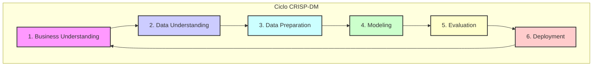

# Previsão de Vendas da Rede Rossmann

## 1. Problema de Negócio

A Rossmann, uma das maiores redes de drogarias da Europa com mais de 3.000 lojas, enfrenta o desafio de prever com precisão suas vendas diárias com até seis semanas de antecedência. Atualmente, essa tarefa é delegada aos gerentes de cada loja, resultando em previsões com grande variação de acurácia, pois são baseadas em experiências empíricas e processos descentralizados.

O objetivo principal deste projeto é desenvolver uma solução centralizada e baseada em dados para **prever as vendas das lojas para as próximas seis semanas**, permitindo um planejamento mais eficiente da alocação de recursos para futuras reformas.

A solução proposta é um **sistema de previsão de vendas utilizando Machine Learning**, com as previsões acessíveis através de uma API REST e um bot no Telegram, garantindo que os stakeholders possam consultar os dados de qualquer lugar.

---

## 2. Arquitetura da Solução

A solução foi desenhada para ser robusta, escalável e de fácil acesso para os usuários finais. O fluxo de dados e interações segue a arquitetura abaixo:

```mermaid
graph TD
    A[👤 Usuário] -->|1. Envia ID da loja (ex: /24)| B(💬 Bot do Telegram);
    B -->|2. Encaminha para Webhook| C{🤖 Serviço do Bot no Render};
    C -->|3. Busca dados e envia p/ API| D{⚙️ API de Previsão no Render};
    D -->|4. Pré-processa e executa modelo| E[🧠 Modelo XGBoost];
    E -->|5. Retorna previsão| D;
    D -->|6. Retorna JSON da previsão| C;
    C -->|7. Formata e envia resposta| B;
    B -->|8. Entrega mensagem final| A;

    style A fill:#D6EAF8,stroke:#333,stroke-width:2px
    style B fill:#AED6F1,stroke:#333,stroke-width:2px
    style C fill:#85C1E9,stroke:#333,stroke-width:2px
    style D fill:#5DADE2,stroke:#333,stroke-width:2px
    style E fill:#3498DB,stroke:#333,stroke-width:2px
```

**Passo a Passo do Fluxo:**

1.  **Interação do Usuário:** Um gerente de loja envia uma mensagem com o ID da loja (ex: `/24`) para o bot no Telegram.
2.  **Webhook:** O Telegram encaminha a mensagem para o serviço do bot hospedado no Render.
3.  **Orquestração do Bot:** O bot recebe a mensagem, extrai o ID da loja e carrega os dados brutos necessários para a previsão.
4.  **Chamada à API:** O bot envia esses dados em formato JSON para a API de previsão, também hospedada no Render.
5.  **Previsão:** A API recebe os dados, aplica todo o pipeline de pré-processamento e utiliza o modelo XGBoost treinado para gerar as previsões de vendas.
6.  **Retorno da Previsão:** A API retorna as previsões em formato JSON para o bot.
7.  **Formatação da Resposta:** O bot recebe as previsões, calcula o faturamento total e formata uma mensagem clara e amigável.
8.  **Entrega ao Usuário:** O bot envia a mensagem final para o usuário no Telegram.

---

## 3. Metodologia - CRISP-DM

O projeto foi estruturado seguindo o **CRISP-DM (Cross-Industry Standard Process for Data Mining)**, uma metodologia robusta e cíclica que garante que o projeto de ciência de dados esteja sempre alinhado com os objetivos de negócio.



---

## 4. Tecnologias Utilizadas

Este projeto foi desenvolvido utilizando o ecossistema Python, com as seguintes bibliotecas e frameworks principais:

-   **Análise e Manipulação de Dados:** `pandas`, `numpy`
-   **Visualização de Dados:** `matplotlib`, `seaborn`
-   **Modelagem de Machine Learning:** `scikit-learn`, `xgboost`, `Boruta`
-   **API e Deploy:** `Flask`, `python-dotenv`
-   **Utilitários:** `inflection`, `requests`, `pickle`

---

## 5. Estrutura do Projeto

O repositório está organizado da seguinte forma para garantir a modularidade e a clareza:

```
.
├── api/                  # Contém o código da API Flask (handler.py) e a classe de pré-processamento (Rossmann.py).
├── bot/                  # Contém o código do bot do Telegram e suas dependências.
├── data/                 # Armazena os dados brutos, limpos e transformados.
├── images/               # Imagens e diagramas utilizados na documentação.
├── model/                # Modelos serializados (.pkl) e objetos de pré-processamento.
├── notebooks/            # Jupyter Notebooks com todo o processo de desenvolvimento.
├── README.md             # Este arquivo.
└── requirements.txt      # Dependências Python para a API.
```

---

## 6. Instalação e Como Executar

Para executar este projeto localmente, siga os passos abaixo. Recomenda-se o uso de ambientes virtuais (`venv`) para isolar as dependências.

### 6.1. Pré-requisitos

-   Python 3.9 ou superior
-   Git

### 6.2. Clonando o Repositório

```bash
git clone https://github.com/seu-usuario/seu-repositorio.git
cd seu-repositorio
```

### 4.3. Executando a API de Previsão

A API é o núcleo do projeto, responsável por receber os dados, processá-los e retornar as previsões.

1.  **Navegue até a pasta da API:**
    ```bash
    cd api
    ```

2.  **Crie e ative um ambiente virtual:**
    ```bash
    python -m venv venv
    source venv/bin/activate  # No Linux/macOS
    # venv\Scripts\activate   # No Windows
    ```

3.  **Instale as dependências:**
    ```bash
    pip install -r requirements.txt
    ```

4.  **Inicie o servidor Flask:**
    ```bash
    python handler.py
    ```
    A API estará rodando em `http://127.0.0.1:8080`.

### 4.4. Executando o Bot do Telegram

O bot serve como uma interface amigável para consultar as previsões da API.

1.  **Abra um novo terminal e navegue até a pasta do bot:**
    ```bash
    cd bot
    ```

2.  **Crie e ative um ambiente virtual:**
    ```bash
    python -m venv venv
    source venv/bin/activate  # No Linux/macOS
    # venv\Scripts\activate   # No Windows
    ```

3.  **Instale as dependências do bot:**
    ```bash
    pip install -r requirements.txt
    ```

4.  **Configure as Variáveis de Ambiente:**
    Crie um arquivo chamado `.env` dentro da pasta `bot/` e adicione as seguintes variáveis:
    ```
    TELEGRAM_BOT_TOKEN="SEU_TOKEN_AQUI"
    API_URL="http://127.0.0.1:8080/rossmann/predict"
    ```
    > **IMPORTANTE:** Adicione o arquivo `.env` ao seu `.gitignore` para não expor seu token.

5.  **Inicie o bot:**
    ```bash
    python rossmann-bot.py
    ```
    O bot agora está online. Envie o ID de uma loja (ex: `/10`) para receber a previsão de vendas.

---

## 5. Análise Exploratória - Principais Insights

A análise exploratória de dados (EDA) foi fundamental para entender a dinâmica das vendas e validar hipóteses de negócio. Abaixo estão os principais insights obtidos:

| Hipótese | Conclusão | Relevância | Insight Principal |
| :--- | :--- | :--- | :--- |
| **Competidores Próximos** | Inválida | Alta | Lojas com competidores mais próximos **vendem mais**, sugerindo que a concorrência se concentra em áreas de alta demanda. |
| **Promoções Prolongadas** | Inválida | Alta | Promoções contínuas (`Promo2`) **não garantem vendas maiores**; o efeito promocional parece diminuir com o tempo. |
| **Feriado de Natal** | Válida | Alta | Lojas que permanecem abertas durante o Natal apresentam uma **mediana de vendas significativamente maior**. |
| **Férias Escolares** | Válida | Alta | As vendas são consistentemente **menores durante os períodos de férias escolares**. |
| **Finais de Semana** | Parcialmente Válida | Média | O volume total de vendas cai nos finais de semana. No entanto, as poucas lojas que abrem aos domingos possuem uma **média de vendas elevada**. |

---

## 6. Preparação dos Dados e Engenharia de Atributos

O processo de preparação dos dados foi encapsulado na classe `Rossmann` e envolveu as seguintes etapas:

1.  **Limpeza de Dados:** Tratamento de valores ausentes com estratégias específicas (ex: `CompetitionDistance` preenchido com um valor alto), padronização dos nomes das colunas para `snake_case` e conversão de tipos de dados.
2.  **Engenharia de Atributos:** Extração de features a partir da data (`ano`, `mês`, `dia`, `semana_do_ano`) e criação de variáveis de negócio, como o tempo em meses desde a abertura de um concorrente (`CompetitionTimeMonth`) e o tempo em semanas desde o início de uma promoção (`PromoTimeWeek`).
3.  **Transformação de Dados:**
    -   **Rescalonamento:** Variáveis numéricas como `CompetitionDistance` e `Year` foram normalizadas para que o modelo não seja enviesado por diferentes escalas.
    -   **Encoding:** Variáveis categóricas foram transformadas em representações numéricas (`One-Hot Encoding` para `StateHoliday`, `Label Encoding` para `StoreType` e `Ordinal Encoding` para `Assortment`).
    -   **Transformação Cíclica:** Features temporais como `DayOfWeek` e `Month` foram transformadas em componentes seno e cosseno para que o modelo entenda sua natureza cíclica.

---

## 7. Modelagem e Resultados

Foram testados múltiplos algoritmos de regressão (Regressão Linear, Lasso, Random Forest, XGBoost). Os modelos não lineares apresentaram performance superior, e o **XGBoost Regressor** foi selecionado como o modelo final devido ao seu excelente equilíbrio entre performance e custo computacional. A avaliação foi realizada utilizando **Validação Cruzada para Séries Temporais**, garantindo uma estimativa robusta do erro em dados não vistos.

Após a tunagem de hiperparâmetros, os resultados finais do modelo no conjunto de teste foram:

| Métrica | Valor | Descrição |
| :--- | :--- | :--- |
| **MAE** (Mean Absolute Error) | 679.33 | Média do erro absoluto entre o previsto e o real. |
| **MAPE** (Mean Absolute Percentage Error) | 9.92% | Média do erro percentual absoluto. |
| **RMSE** (Root Mean Squared Error) | 995.73 | Raiz do erro quadrático médio, que penaliza mais os erros grandes. |

---

## 8. Análise de Negócio e Financeira

O desempenho do modelo foi traduzido em impacto de negócio, fornecendo uma visão clara do seu valor financeiro.

-   **Previsão de Faturamento Total:** O modelo prevê um faturamento total de **R$ 283.76 milhões** para as próximas 6 semanas, considerando todas as lojas.
-   **Cenários de Risco:** Para auxiliar na tomada de decisão, foram calculados o melhor e o pior cenário, que estimam um faturamento entre **R$ 283.00 milhões** e **R$ 284.52 milhões**.
-   **Análise por Loja:** O modelo permite analisar o erro (MAPE) individualmente por loja, identificando aquelas onde a previsão é mais ou menos assertiva e direcionando ações específicas.

---

## 9. Próximos Passos

-   **Completar o Ano de 2015:** Identificar e coletar os meses faltantes de 2015 para garantir a integridade temporal dos dados.
-   **Engenharia de Features Avançada:** Explorar a criação de novas variáveis e interações entre elas para capturar padrões mais complexos.
-   **Análise de Resultados do Modelo:** Coletar e consolidar os resultados práticos do modelo para identificar padrões de erro.
-   **Tratamento de Lojas com Alto Erro:** Investigar as causas de erro em lojas com MAPE > 25%, avaliando abordagens como segmentação de modelos ou inclusão de variáveis contextuais.
-   **Redução do Erro do Modelo:** Testar algoritmos alternativos e diferentes técnicas de tratamento de outliers.
-   **Monitoramento e Atualização Contínua:** Estabelecer rotinas de monitoramento do desempenho do modelo em produção e definir critérios para re-treinamento periódico.
-   **Documentação e Reprodutibilidade:** Manter a documentação de todas as etapas do pipeline atualizada para garantir a reprodutibilidade e facilitar futuras manutenções.