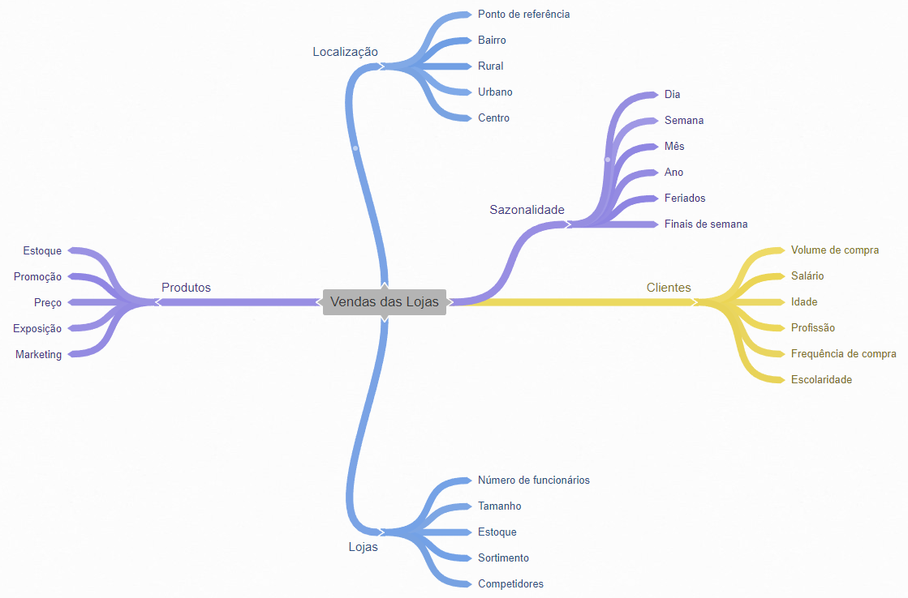
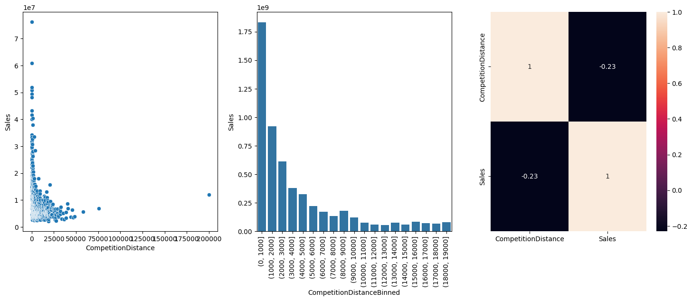
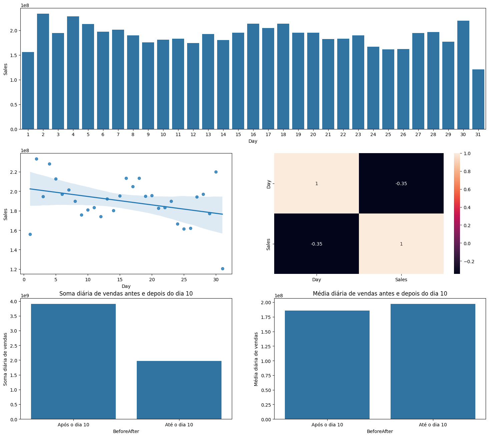
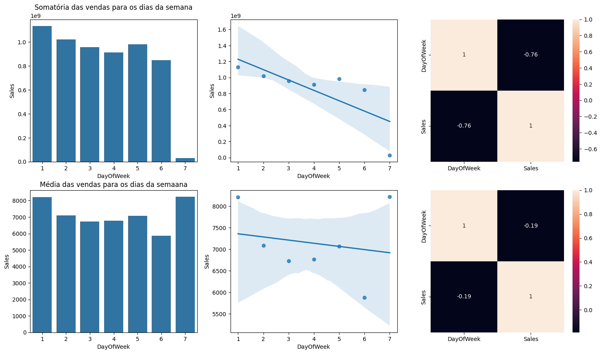
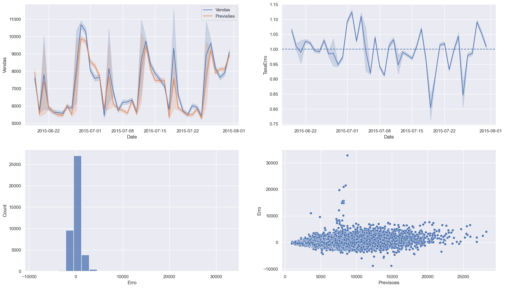
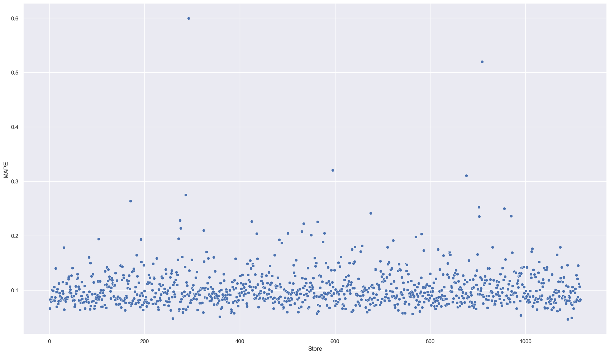

  

# Previsão de Vendas - Rossmann

> **Status:** Finalizado ✔️

## 1. Problema de Negócio

A Rossmann, uma das maiores redes de drogarias da Europa, opera mais de 3.000 lojas e necessita de uma previsão de vendas precisa para as próximas 6 semanas. Atualmente, as previsões são feitas individualmente pelos gerentes de cada loja, baseadas em suas experiências, o que gera uma grande variação na acurácia e dificulta o planejamento centralizado de recursos, como a alocação de verbas para reformas.

O objetivo deste projeto é desenvolver um modelo de Machine Learning que forneça previsões de vendas centralizadas e precisas, auxiliando o CFO na tomada de decisões estratégicas sobre o orçamento de reformas.

## 2. Metodologia
O projeto foi estruturado seguindo a metodologia **CRISP-DS**, dividida em 10 etapas:

1.  Compreender com clareza o modelo e o problema de negócios, usando estatísticas descritivas.
2.  AnalisarTratar os dados (formatos, dados faltantes, outliers), realizando a limpeza necessária.
3.  Junto com o time de negócios, identificar quais são as características que influenciam nas vendas. Formular e validar hipóteses para gerar insights.
4.  Preparar os dados para criar o modelo de previsão de vendas, fazendo transformações, separando o dataframe em treino, validação e teste, e automatizando a escolha das “features” mais importantes.
5. Treinar algoritmos de Machine Learning (lineares e não lineares), comparar os resultados e escolher o que tiver melhor desempenho.
6. Encontrar e ajustar os parâmetros do modelo para melhorar o aprendizado e reduzir o erro nas previsões.
7. Interpretar o erro do modelo e traduzir isso em impacto financeiro para a empresa.
8. Avaliar se a previsão de vendas já está gerando valor para o time de negócios. Se sim, publicar em produção; se não, fazer ajustes para melhorias.
9. Depois de publicado, criar um robô no Telegram que permita acessar a previsão em tempo real, de qualquer lugar.
10. Apresentar o bot do Telegram aos gerentes e ao CFO, explicando como o modelo funciona e tirando todas as dúvidas.

## 3. Hipóteses de Negócio

Para guiar a análise, foram levantadas hipóteses sobre os fatores que influenciam as vendas. São apresentados os 3 principais insights. O mapa mental abaixo seviu de guia para a elaboração das hipóteses.

  

#### Hipótese 1: Lojas com competidores mais próximos vendem menos.
> **FALSO.** A hipótese de que lojas com competidores mais distantes vendem mais é refutada pelos dados. Os gráficos mostram claramente o oposto: lojas com competidores mais próximos tendem a ter um volume de vendas total maior. A correlação negativa de -0.23, embora fraca, apoia essa conclusão, indicando que um aumento na distância está associado a uma leve diminuição nas vendas.

  

#### Hipótese 8: Após o dia 10 de cada mês, as vendas tendem a aumentar.
> **FALSO.** A hipótese de que as vendas aumentam após o dia 10 não é confirmada. O gráfico de média diária mostra que as vendas permanecem estáveis antes e depois do dia 10, sem aumento significativo. O total acumulado após o dia 10 é maior apenas porque há mais dias nesse intervalo, não porque as vendas diárias aumentam.

  

#### Hipótese 9: Lojas vendem menos aos finais de semana.
> **PARCIALMENTE VERDADEIRA.** O volume total de vendas cai significativamente nos finais de semana, especialmente no domingo. No entanto, a média de vendas por loja aberta no domingo é a mais alta da semana. Isso sugere que, embora menos lojas abram aos domingos, aquelas que o fazem conseguem vender mais, possivelmente devido à menor concorrência ou a um fluxo de clientes mais concentrado.

  

## 4. Desenvolvimento

### 4.1. Engenharia e Seleção de Atributos

O processo de preparação dos dados foi encapsulado na classe `Rossmann` e envolveu as seguintes etapas:

1.  **Limpeza de Dados:** Tratamento de valores ausentes, padronização dos nomes das colunas e conversão de tipos de dados.
2.  **Engenharia de Atributos:** Extração de features a partir da data (`ano`, `mês`, `dia`, `semana_do_ano`) e criação de variáveis de negócio, como o tempo em meses desde a abertura de um concorrente (`CompetitionTimeMonth`) e o tempo em semanas desde o início de uma promoção (`PromoTimeWeek`).
3.  **Transformação de Dados:**
    -   **Rescalonamento:** Variáveis numéricas foram normalizadas para que o modelo não seja enviesado por diferentes escalas.
    -   **Encoding:** Variáveis categóricas foram transformadas em representações numéricas.
    -   **Transformação Cíclica:** Features temporais como `DayOfWeek` e `Month` foram transformadas em componentes seno e cosseno para que o modelo entenda sua natureza cíclica.
4.  **Seleção de Atributos:** O algoritmo **Boruta** foi utilizado para selecionar as features mais relevantes para o modelo, otimizando a performance e reduzindo a complexidade.

### 4.2. Modelagem e Avaliação

Foram testados múltiplos algoritmos de regressão (Regressão Linear, Lasso, Random Forest, XGBoost). Os modelos não lineares apresentaram performance superior, e o **XGBoost Regressor** foi selecionado como o modelo final devido ao seu excelente equilíbrio entre performance e custo computacional.

A avaliação foi realizada utilizando **Validação Cruzada para Séries Temporais**, garantindo uma estimativa robusta do erro em dados não vistos.

## 5. Performance do Modelo

A performance do modelo foi avaliada em diferentes estágios do projeto para garantir a melhor escolha e otimização.

### 5.1. Performance dos Modelos (Sem Cross-Validation)

> Nesta primeira avaliação, os modelos não lineares (Random Forest e XGBoost) já demonstram uma performance muito superior aos modelos lineares, indicando a complexidade do problema.

| Model Name | MAE | MAPE | RMSE |
| :--- | :--- | :--- | :--- |
| Random Forest Regressor | 679.19 | 9.98% | 1010.31 |
| XGBoost Regressor | 844.95 | 12.29% | 1246.30 |
| Modelo de Média | 1354.80 | 20.64% | 1835.14 |
| Regressão Linear | 1867.09 | 29.27% | 2671.05 |
| Regressão Linear - Lasso | 1900.35 | 28.85% | 2768.02 |

### 5.2. Performance dos Modelos (Com Cross-Validation)

> A validação cruzada fornece uma estimativa mais realista da performance. O Random Forest se destaca, mas o XGBoost apresenta um ótimo resultado com um custo computacional significativamente menor, tornando-o a escolha para a próxima fase.

| Model Name | MAE | MAPE | RMSE |
| :--- | :--- | :--- | :--- |
| Random Forest Regressor | 836.83 +/- 217.47 | 12% +/- 2% | 1254.60 +/- 316.67 |
| XGBoost Regressor | 1038.0 +/- 165.93 | 14% +/- 1% | 1492.25 +/- 229.28 |
| Regressão Linear | 2081.73 +/- 295.63 | 30% +/- 2% | 2952.52 +/- 468.37 |
| Lasso | 2128.31 +/- 368.92 | 30% +/- 1% | 3067.48 +/- 549.40 |

### 5.3. Performance do XGBoost (Após Fine-Tuning)

> Após a otimização dos hiperparâmetros, a performance do XGBoost na validação cruzada melhorou consideravelmente, aproximando-se do resultado inicial do Random Forest.

| Métrica | Valor |
| :--- | :--- |
| **MAE** | 857.01 +/- 143.21 |
| **MAPE**| 12% +/- 1% |
| **RMSE**| 1238.06 +/- 205.83 |

### 5.4. Performance Final (Dados de Teste)

> O modelo final, treinado com todos os dados de treino e validação, foi avaliado no conjunto de teste, que simula dados futuros. Os resultados demonstram um erro percentual médio de aproximadamente **10%**, um excelente resultado para o negócio.

| Métrica | Valor |
| :--- | :--- |
| **MAE** (Mean Absolute Error) | 698.03 |
| **MAPE** (Mean Absolute Percentage Error) | 10.28% |
| **RMSE** (Root Mean Squared Error) | 1017.62 |
 
 

#### 5.4.1 Gráfico de Performance do Modelo: Predição vs. Real

  
   
  <em>O gráfico acima mostra a relação entre a predição e o valor real, com a linha pontilhada representando a predição perfeita.</em>

 
 

#### 5.4.2 Distribuição do Erro Percentual Absoluto Médio (MAPE) por Loja

  
   
  <em>O erro (MAPE) por loja, mostrando que a maioria das previsões está abaixo de 20% de erro.</em>

## 5. Resultados para o Negócio

O desempenho do modelo foi traduzido em impacto de negócio, fornecendo uma visão clara do seu valor financeiro.

### 5.1. Previsão de Faturamento Total

O modelo prevê um faturamento total de **R$ 284.11 milhões** para as próximas 6 semanas. Para auxiliar na tomada de decisão, foram calculados cenários de risco.

| Cenário | Valor |
| :--- | :--- |
| **Previsão Total** | **R$ 284,111,488.00** |
| Pior Cenário | R$ 283,329,570.31 |
| Melhor Cenário | R$ 284,893,384.85 |

### 5.2. Análise de Erros por Loja

A análise dos erros por loja permite identificar onde o modelo é mais e menos preciso, possibilitando investigações futuras.

**Top 5 Lojas com Menor Erro (MAPE)**

| Store | Previsão (6 semanas) | MAE | MAPE |
| :--- | :--- | :--- | :--- |
| 1089 | R$ 375,506.19 | R$ 507.64 | 4.63% |
| 259 | R$ 529,942.13 | R$ 634.55 | 4.77% |
| 1097 | R$ 450,199.13 | R$ 545.12 | 4.94% |
| 358 | R$ 356,857.63 | R$ 495.95 | 5.10% |
| 990 | R$ 239,213.25 | R$ 328.79 | 5.40% |

**Top 5 Lojas com Maior Erro (MAPE)**

| Store | Previsão (6 semanas) | MAE | MAPE |
| :--- | :--- | :--- | :--- |
| 292 | R$ 108,321.38 | R$ 3,407.46 | 59.94% |
| 909 | R$ 228,187.33 | R$ 7,777.18 | 51.99% |
| 595 | R$ 355,734.47 | R$ 4,688.61 | 32.03% |
| 876 | R$ 200,063.42 | R$ 4,000.01 | 31.02% |
| 286 | R$ 162,590.33 | R$ 742.36 | 27.48% |

## 6. Conclusão e Próximos Passos

O projeto entregou com sucesso um sistema de previsão de vendas com um erro médio de **10.28%**, fornecendo uma ferramenta valiosa para o planejamento financeiro da Rossmann. O modelo é capaz de prever um faturamento de **R$ 284.11 milhões** para as próximas 6 semanas.

O objetivo do projeto foi alcançado, dado que o produto de dados proposto foi gerado com sucesso. Agora o CFO e os gerentes podem utilizar a solução para tomar decisões estratégicas com mais assertividade.

**Próximo Ciclo do CRISP-DM:**
1. **Completar o Ano de 2015:**
Identificar e coletar os meses faltantes de 2015 para garantir a integridade temporal dos dados, evitando viés na modelagem.

2. **Engenharia de Features Avançada**
Explorar a criação de novas variáveis, além de interações entre variáveis relevantes para capturar padrões complexos.

3. **Tratamento de Lojas com Alto Erro Percentual (>25%)**
Investigar causas de alto erro em lojas específicas, avaliando abordagens como segmentação de modelos, ajuste de hiperparâmetros, ou inclusão de variáveis contextuais (ex: localização, perfil de clientes).

4. **Redução do Erro do Modelo**
Testar algoritmos alternativos e tratamento de outliers.

5. **Monitoramento e Atualização Contínua**
Estabelecer rotinas de monitoramento do desempenho do modelo em produção e definir critérios para re-treinamento periódico com novos dados.

6. **Documentação e Reprodutibilidade**
Documentar todas as etapas do pipeline de dados e modelagem, garantindo reprodutibilidade e facilitando futuras manutenções.

## 7. Tecnologias Utilizadas

| Ferramenta | Descrição |
| :--- | :--- |
| **Python 3.9** | Linguagem principal do projeto. |
| **Pandas, Numpy** | Manipulação e análise de dados. |
| **Matplotlib, Seaborn** | Visualização de dados. |
| **Scikit-learn, XGBoost, Boruta** | Modelagem e seleção de features. |
| **Flask** | Desenvolvimento da API REST. |
| **Render** | Plataforma de deploy para a API e o bot. |
| **GitHub Actions** | Automação de CI/CD e manutenção dos serviços. |
| **Jupyter Notebook** | Ambiente de desenvolvimento e prototipação. |

## 8. Autor

Desenvolvido por **Marcos Alessandro da Fonseca**

[!LinkedIn](https://www.linkedin.com/in/alessandro-datascientist/)